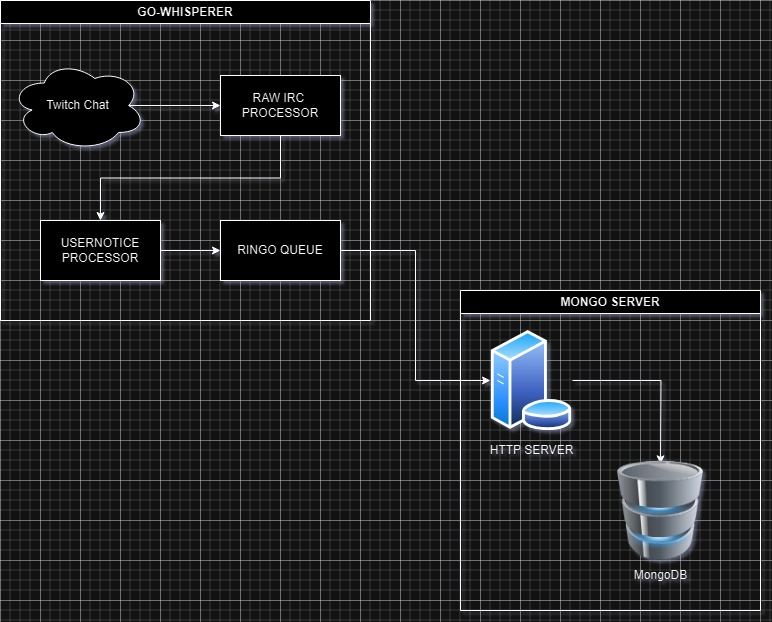

# Overview

This project implements a workflow that captures incoming subscription events from Twitch using the Internet Relay Chat (IRC) protocol and stores the data in a MongoDB database. This allows users to keep track of subscribers in real-time, for the sake of analytics.

## Prerequisites
+ A MongoDB database instance (local or cloud-based).
+ Docker to run the programs together

## How it works



## Deployment

Clone the project

```bash
  git clone https://github.com/RingoMar/marstats.git
```

Go to the project directory

```bash
  cd marstats
```

Setup docker

```bash
  sh setup_network.sh
```

Start

```bash
  docker compose up
```

# License
This project is licensed under the MIT License. See the [LICENSE](LICENSE) file for details.

# Acknowledgments
+ [Twitch Developer Documentation](https://dev.twitch.tv/docs)
+ [MongoDB Documentation](https://docs.mongodb.com/)